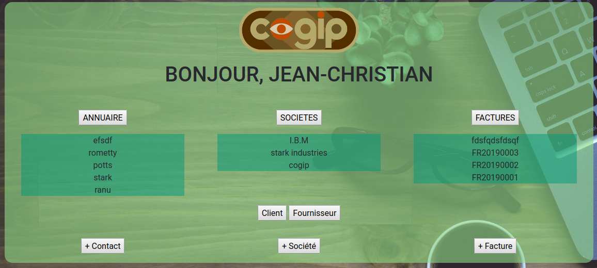
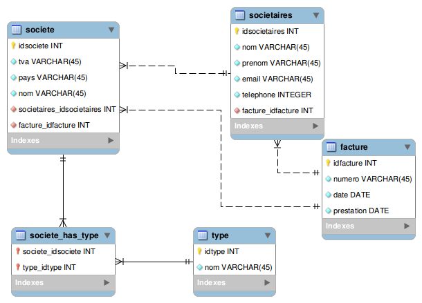
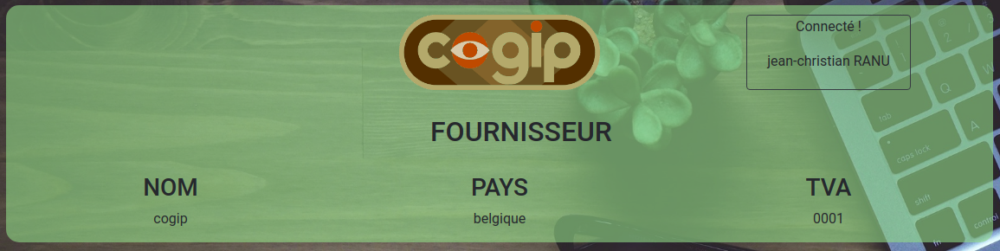
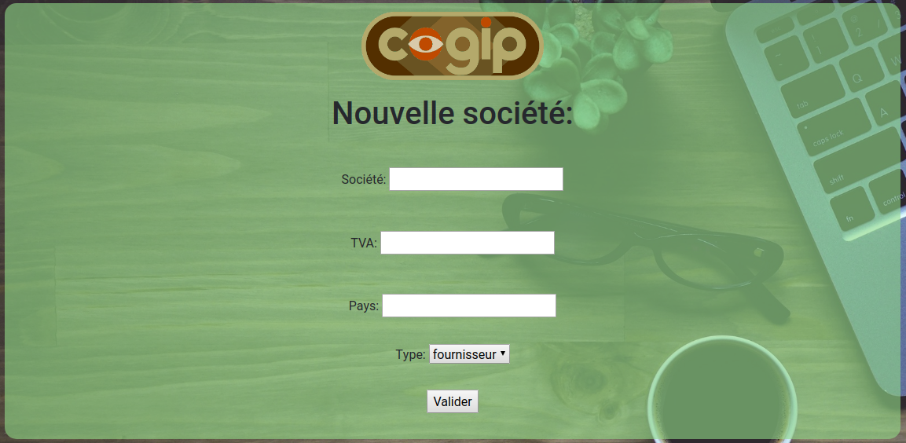
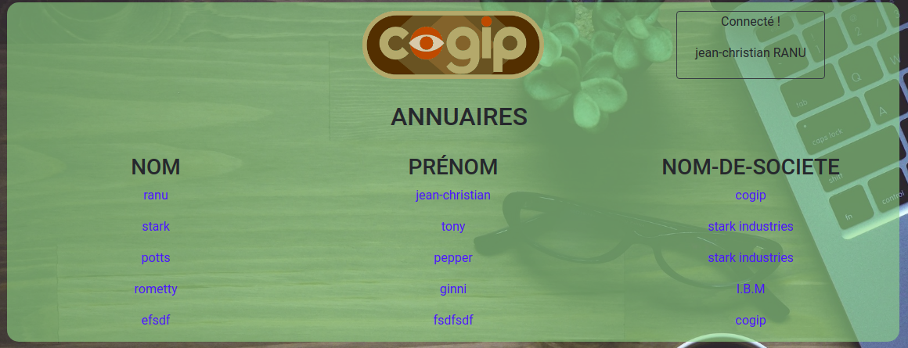

# 
 COGIP 

### Languages utilisés
HTML5, CSS3, PHP, MySQL, Bootstrap

## 
 Présentation 

Voici un site ayant pour but de recenser des factures pour une societé. avec, liées à celles-ci , des entreprises et des personnes de contact. Il est d'application de donner à l'utilisateur la possibilité de d'ajouter , modifier ou supprimer des factures. L'important dans ce projet est de pouvoir donner un outil simple qui permet de travailler en ayant les informations nécessaires à portée de main.

## 
 Création 

### Début de projet : 08 Avril 2019
Pour une durée d'une semaine , nous avons du commencer par une moquette low-fi du projet, que vous pouvez-voir ici :

afin de pouvoir prévoir la finalité du site, nous nous sommes mis à la place de l'utilisateur , et cette maquette nous a permis de structurer : l'apparence du site, les dossiers et les pages... et notre base de données, surtout !

### Une base de données... basique ?
aussi étrange que celà puisse paraître, lors de l'affichage des élements , il est important de pouvoir clairement structurer leurs liens intrinsèques. et pour ne pas devoir afficher quarante fois les mêmes éléments , il est plus facile de les stocker dans une base de données , et ensuite de faire des liens sur la page et d'y faire appel. D'où l'importence de la structure de ceci : 

Il est donc possible grace à ces liens de, par exemple , cliquer sur une société et voir toutes les factures qui lui sont associées, ou toutes les personnes de contact, etc...

 grace à ceci, il était assez facile de mettre en forme notre site visuellement ! 

## 
 Screenshots 

Toutes les images sont libres de droit; voici quelques images visuelles de l'environnement de travail de nos amis de la COGIP !

### Créateurs

Teddy Wauquier et Pablo Mombo

Teddy            |  Pablo
:-------------------------:|:-------------------------:
  |  

### License

Ce poject est sous licence BeCode™

### Code d'acces

Pseudo: Jean-Christian
Pass: COGIP
